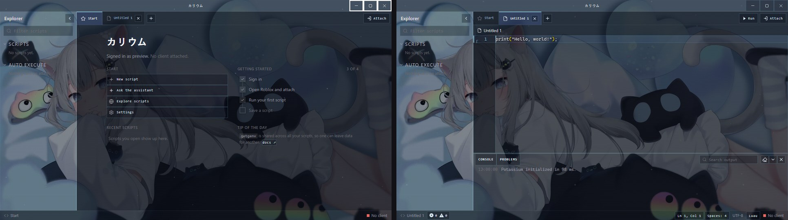
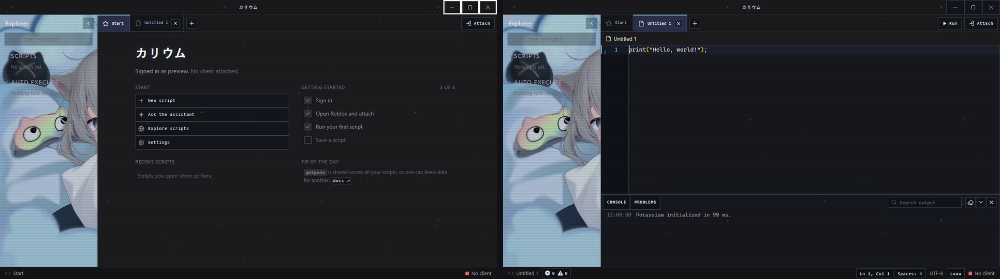
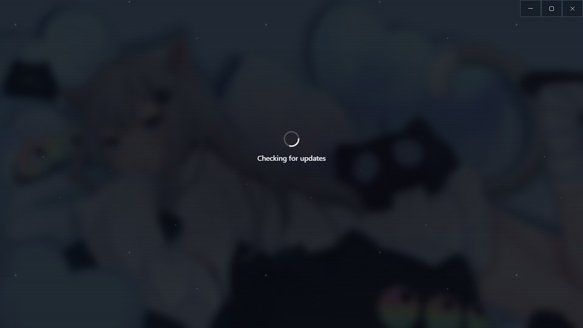

# Lain theme for Potassium

A Serial Experiments Lain–inspired theme for the Potassium executor: square corners, snow and scanline overlays, glassy blue panels, monospace labels, カリウム in the title bar and a "WIRED LINK ESTABLISHED" status strip, with an animated wallpaper behind the whole app.

<picture>
  <source srcset="window.avif" type="image/avif">
  
</picture>

The preview is animated (AVIF). Browsers that can't play AVIF show a still screenshot instead.

## Credit

The original theme was made by **Misanthropy (xzyp)**: [Discord](https://discord.com/users/578664539500052490) (user ID `578664539500052490`) · [guns.lol/xzyp](https://guns.lol/xzyp).

This version adds a few tweaks on top:

- Editor, console, tab bar and status bar are see-through, so the wallpaper shows behind the whole app instead of only behind the explorer.
- A light dark tint over the wallpaper keeps text readable on bright frames.
- The editor's minimap no longer draws a solid dark strip on the right.

Prefer it exactly as Misanthropy made it? [`Original.css`](Original.css) is the untouched original. Install it the same way as `Theme.css` below.

<picture>
  <source srcset="window-original.avif" type="image/avif">
  
</picture>

In the original, the wallpaper shows behind the explorer while the editor and start page stay solid.

## Loading screen

Both versions also show the wallpaper, blurred and dimmed, while Potassium is loading or on the login screen.

<picture>
  <source srcset="loading.avif" type="image/avif">
  
</picture>

This comes from the `[class*="backdrop"]` rule: Potassium shows its own picture in a `.backdrop` layer while it starts up, and the theme's `background: … !important` replaces that picture with a see-through dark glass, so the wallpaper behind it shows through.

## Install

1. In Potassium, open **Settings → Appearance → Custom theme**.
2. Set **Base theme** to **Dark**.
3. Copy everything in [`Theme.css`](Theme.css) and paste it into **Custom CSS**.
4. Type a name under **Save** and click **Save**.

## Notes

- The wallpaper is a GIF hosted on Imgur and is about **197 MB**. It can take a while to load the first time and uses a fair amount of memory while it plays.
- The theme blurs and disables clicks on the main window while a dialog or popup is open. If Potassium ever stops responding to clicks, remove the block that starts with `body:has(`.
- The theme is about 14,000 characters, well under Potassium's 50,000-character limit for custom CSS.
